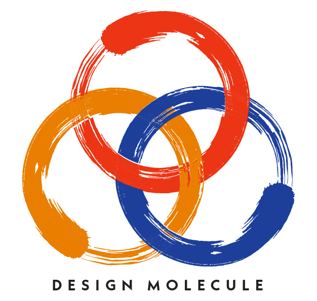

  

# Design Molecule

**Pragmatic minds, building what matters.**

[Design Molecule](https://designmolecule.com) works at the intersection of engineering rigor, creative thinking and strategic clarity. This is its open lab: garage-buildable hardware concepts that take a real problem, break it into measurable requirements, and work it through to a documented proof of concept that anyone can inspect, build on or challenge.

---

## Open designs

Each card links to the repository, with its drawings, calculations, bill of materials and a downloadable design pack.

### Clean tech

<table>
<tr>
<td width="33%" valign="top"> <b><a href="https://github.com/BoujeeEnjinia1701/thermabrick">ThermaBrick</a></b> sand thermal battery charged from surplus solar</td>
<td width="33%" valign="top"> <b><a href="https://github.com/BoujeeEnjinia1701/picoflow">PicoFlow</a></b> 3D-printed pico hydro turbine</td>
<td width="33%" valign="top"> <b><a href="https://github.com/BoujeeEnjinia1701/heliolite">HelioLite</a></b> two-axis mini heliostat that redirects sunlight</td>
</tr>
<tr>
<td width="33%" valign="top"> <b><a href="https://github.com/BoujeeEnjinia1701/charcube">CharCube</a></b> batch retort kiln that turns biomass into biochar</td>
<td width="33%" valign="top"> <b><a href="https://github.com/BoujeeEnjinia1701/dustrunner">DustRunner</a></b> rail-free brush robot that dry-cleans solar panel rows</td>
<td width="33%" valign="top"> <b><a href="https://github.com/BoujeeEnjinia1701/powerbox">PowerBox</a></b> multi-input power station built on SwapCell</td>
</tr>
<tr>
<td width="33%" valign="top"> <b><a href="https://github.com/BoujeeEnjinia1701/pvtrace">PVTrace</a></b> handheld solar panel IV curve tracer</td>
<td width="33%" valign="top"> <b><a href="https://github.com/BoujeeEnjinia1701/thermacart">ThermaCart</a></b> swappable phase-change thermal storage cartridge</td>
<td width="33%" valign="top"> <b><a href="https://github.com/BoujeeEnjinia1701/cellguard">CellGuard</a></b> open battery management board for small LiFePO4 packs</td>
</tr>
</table>

### Food and water security

<table>
<tr>
<td width="33%" valign="top"> <b><a href="https://github.com/BoujeeEnjinia1701/potpress">PotPress</a></b> hand-pumped hydraulic press for ceramic pot water filters</td>
<td width="33%" valign="top"> <b><a href="https://github.com/BoujeeEnjinia1701/lumaflow">LumaFlow</a></b> inline UV-C water disinfection reactor for a household tap</td>
<td width="33%" valign="top"> <b><a href="https://github.com/BoujeeEnjinia1701/dewdrive">DewDrive</a></b> solar-regenerated desiccant water-from-air harvester</td>
</tr>
<tr>
<td width="33%" valign="top"> <b><a href="https://github.com/BoujeeEnjinia1701/stillstack">StillStack</a></b> multi-stage solar wick still that reuses condensation heat</td>
<td width="33%" valign="top"> <b><a href="https://github.com/BoujeeEnjinia1701/waterwatch">WaterWatch</a></b> solar tap and tank water quality sentinel</td>
<td width="33%" valign="top"> <b><a href="https://github.com/BoujeeEnjinia1701/wellsense">WellSense</a></b> well and borehole water level logger</td>
</tr>
<tr>
<td width="33%" valign="top"> <b><a href="https://github.com/BoujeeEnjinia1701/leaklisten">LeakListen</a></b> acoustic leak sensor for water mains</td>
<td width="33%" valign="top"> <b><a href="https://github.com/BoujeeEnjinia1701/zeerbox">ZeerBox</a></b> walk-in evaporative cooling chamber</td>
<td width="33%" valign="top"> <b><a href="https://github.com/BoujeeEnjinia1701/grainguard">GrainGuard</a></b> grain bin probes that run aeration only when it helps</td>
</tr>
<tr>
<td width="33%" valign="top"> <b><a href="https://github.com/BoujeeEnjinia1701/seedline">SeedLine</a></b> push seeder with 3D-printed metering plates</td>
<td width="33%" valign="top"> <b><a href="https://github.com/BoujeeEnjinia1701/rootmesh">RootMesh</a></b> solar soil moisture stakes on LoRa</td>
<td width="33%" valign="top"> <b><a href="https://github.com/BoujeeEnjinia1701/steamroot">SteamRoot</a></b> biomass steam generator for soil pasteurization</td>
</tr>
</table>

### Circular economic models

<table>
<tr>
<td width="33%" valign="top"> <b><a href="https://github.com/BoujeeEnjinia1701/wastewise-scan">WasteWise Scan</a></b> handheld near-infrared resin scanner</td>
<td width="33%" valign="top"> <b><a href="https://github.com/BoujeeEnjinia1701/WasteWise-ml">WasteWise-ml</a></b> open image model that sorts waste by material class and grade</td>
<td width="33%" valign="top"> <b><a href="https://github.com/BoujeeEnjinia1701/refloweconomy">ReflowEconomy</a></b> open playbook for local material recovery micro-factories</td>
</tr>
<tr>
<td width="33%" valign="top"> <b><a href="https://github.com/BoujeeEnjinia1701/cellcheck">CellCheck</a></b> bench grader for salvaged lithium cells</td>
<td width="33%" valign="top"> <b><a href="https://github.com/BoujeeEnjinia1701/micromold">MicroMold</a></b> desktop injection press for recycled plastic</td>
<td width="33%" valign="top"> <b><a href="https://github.com/BoujeeEnjinia1701/binlevel">BinLevel</a></b> fill-level sensor for public and communal bins</td>
</tr>
</table>

### Automation

<table>
<tr>
<td width="33%" valign="top"> <b><a href="https://github.com/BoujeeEnjinia1701/motioncore">MotionCore</a></b> drive controller and safety module with e-stop and reference hub motor</td>
<td width="33%" valign="top"> <b><a href="https://github.com/BoujeeEnjinia1701/palletpilot">PalletPilot</a></b> power and follow-me retrofit for manual pallet jacks</td>
<td width="33%" valign="top"> <b><a href="https://github.com/BoujeeEnjinia1701/stepclimber">StepClimber</a></b> motor-assisted stair-climbing hand truck</td>
</tr>
<tr>
<td width="33%" valign="top"> <b><a href="https://github.com/BoujeeEnjinia1701/culvertcrawl">CulvertCrawl</a></b> tethered crawler that inspects culverts and pipes</td>
<td width="33%" valign="top"> <b><a href="https://github.com/BoujeeEnjinia1701/machinepulse">MachinePulse</a></b> clip-on condition monitor for older machines</td>
<td width="33%"></td>
</tr>
</table>

### Autonomous and assisted mobility

<table>
<tr>
<td width="33%" valign="top"> <b><a href="https://github.com/BoujeeEnjinia1701/swapcell">SwapCell</a></b> swappable e-bike battery pack and wall charging dock</td>
<td width="33%" valign="top"> <b><a href="https://github.com/BoujeeEnjinia1701/sunspoke">SunSpoke</a></b> bolt-on electric conversion kit for steel bicycles</td>
<td width="33%" valign="top"> <b><a href="https://github.com/BoujeeEnjinia1701/cargomule">CargoMule</a></b> electric-assist cargo trailer for most bicycles</td>
</tr>
<tr>
<td width="33%" valign="top"> <b><a href="https://github.com/BoujeeEnjinia1701/flattrike">FlatTrike</a></b> flat-pack cargo tricycle cut from sheet steel</td>
<td width="33%" valign="top"> <b><a href="https://github.com/BoujeeEnjinia1701/stepgen">StepGen</a></b> walking-treadmill vehicle</td>
<td width="33%" valign="top"> <b><a href="https://github.com/BoujeeEnjinia1701/waterwalker">WaterWalker</a></b> walk-inside four-wheel water carrier</td>
</tr>
<tr>
<td width="33%" valign="top"> <b><a href="https://github.com/BoujeeEnjinia1701/growrider">GrowRider</a></b> repairable children's bicycle that grows with the rider</td>
<td width="33%" valign="top"> <b><a href="https://github.com/BoujeeEnjinia1701/dockhub">DockHub</a></b> street-side battery swap station for SwapCell packs</td>
<td width="33%"></td>
</tr>
</table>

### Advanced manufacturing and design

<table>
<tr>
<td width="33%" valign="top"> <b><a href="https://github.com/BoujeeEnjinia1701/gridbench">GridBench</a></b> open hole-grid workbench and fixture standard</td>
<td width="33%" valign="top"> <b><a href="https://github.com/BoujeeEnjinia1701/calrig">CalRig</a></b> calibration rig for low-cost sensors</td>
<td width="33%" valign="top"> <b><a href="https://github.com/BoujeeEnjinia1701/snapframe">SnapFrame</a></b> shelter frame kit from conduit and printed nodes</td>
</tr>
</table>

### Sustainable housing

<table>
<tr>
<td width="33%" valign="top"> <b><a href="https://github.com/BoujeeEnjinia1701/emberguard">EmberGuard</a></b> ember detector that triggers roof-edge sprinklers</td>
<td width="33%" valign="top"> <b><a href="https://github.com/BoujeeEnjinia1701/earthpress">EarthPress</a></b> manual compressed earth block press</td>
<td width="33%" valign="top"> <b><a href="https://github.com/BoujeeEnjinia1701/breathebox">BreatheBox</a></b> window-mounted heat recovery ventilator for single rooms</td>
</tr>
</table>

### Mining

<table>
<tr>
<td width="33%" valign="top"> <b><a href="https://github.com/BoujeeEnjinia1701/gravitysort">GravitySort</a></b> mercury-free gravity concentrator for small-scale gold</td>
<td width="33%" valign="top"> <b><a href="https://github.com/BoujeeEnjinia1701/dustbadge">DustBadge</a></b> wearable respirable dust monitor for workers</td>
<td width="33%" valign="top"> <b><a href="https://github.com/BoujeeEnjinia1701/slopewatch">SlopeWatch</a></b> tilt and displacement sensors for slopes and tailings</td>
</tr>
</table>

### Hydrogen economy

<table>
<tr>
<td width="33%" valign="top"> <b><a href="https://github.com/BoujeeEnjinia1701/h2guard">H2Guard</a></b> hydrogen leak detector and ventilation interlock</td>
<td width="33%" valign="top"> <b><a href="https://github.com/BoujeeEnjinia1701/h2bench">H2Bench</a></b> hydrogen teaching bench from water to electricity and back</td>
<td width="33%"></td>
</tr>
</table>

### Digital twins

<table>
<tr>
<td width="33%" valign="top"> <b><a href="https://github.com/BoujeeEnjinia1701/twinkit">TwinKit</a></b> open digital twin starter kit and gateway</td>
<td width="33%" valign="top"> <b><a href="https://github.com/BoujeeEnjinia1701/citytwin">CityTwin</a></b> open city dashboard and kiosk for the smart city nodes</td>
<td width="33%"></td>
</tr>
</table>

### Smart and resilient cities

<table>
<tr>
<td width="33%" valign="top"> <b><a href="https://github.com/BoujeeEnjinia1701/curbcount">CurbCount</a></b> privacy-safe street counter that sends counts, never images</td>
<td width="33%" valign="top"> <b><a href="https://github.com/BoujeeEnjinia1701/crosssafe">CrossSafe</a></b> solar crossing beacon for unsignalized crossings</td>
<td width="33%" valign="top"> <b><a href="https://github.com/BoujeeEnjinia1701/potholelog">PotholeLog</a></b> vehicle-mounted road roughness logger</td>
</tr>
<tr>
<td width="33%" valign="top"> <b><a href="https://github.com/BoujeeEnjinia1701/loadzone">LoadZone</a></b> curbside loading bay occupancy sensor</td>
<td width="33%" valign="top"> <b><a href="https://github.com/BoujeeEnjinia1701/heatmap-node">HeatMap Node</a></b> street-level heat stress node</td>
<td width="33%" valign="top"> <b><a href="https://github.com/BoujeeEnjinia1701/floodgauge">FloodGauge</a></b> street and drain water level sensor</td>
</tr>
<tr>
<td width="33%" valign="top"> <b><a href="https://github.com/BoujeeEnjinia1701/airstreet">AirStreet</a></b> street-level PM2.5 and NO2 air quality node</td>
<td width="33%" valign="top"> <b><a href="https://github.com/BoujeeEnjinia1701/noisemap">NoiseMap</a></b> sound level node that records decibels, never audio</td>
<td width="33%" valign="top"> <b><a href="https://github.com/BoujeeEnjinia1701/coolshade">CoolShade</a></b> solar shade canopy with misting for heat stress</td>
</tr>
<tr>
<td width="33%" valign="top"> <b><a href="https://github.com/BoujeeEnjinia1701/lampnode">LampNode</a></b> open streetlight controller and sensor host</td>
<td width="33%" valign="top"> <b><a href="https://github.com/BoujeeEnjinia1701/bridgepulse">BridgePulse</a></b> vibration and strain monitor for small bridges</td>
<td width="33%"></td>
</tr>
</table>

### Open engineering

<table>
<tr>
<td width="33%" valign="top"> <b><a href="https://github.com/BoujeeEnjinia1701/fieldnode">FieldNode</a></b> solar-powered outdoor sensor node core</td>
<td width="33%" valign="top"> <b><a href="https://github.com/BoujeeEnjinia1701/readykit">ReadyKit</a></b> the lab's documentation and readiness kit as an open tool</td>
<td width="33%"></td>
</tr>
</table>

### Field and emergency

<table>
<tr>
<td width="33%" valign="top"> <b><a href="https://github.com/BoujeeEnjinia1701/fieldcell">FieldCell</a></b> hand cart with fold-out solar and a battery bank</td>
<td width="33%" valign="top"> <b><a href="https://github.com/BoujeeEnjinia1701/conepro">ConePro</a></b> digital dynamic cone penetrometer for field soil testing</td>
<td width="33%"></td>
</tr>
</table>

### Health research prototypes (not medical devices)

<table>
<tr>
<td width="33%" valign="top"> <b><a href="https://github.com/BoujeeEnjinia1701/tremortrace">TremorTrace</a></b> wrist band that logs tremor over the day (research prototype)</td>
<td width="33%" valign="top"> <b><a href="https://github.com/BoujeeEnjinia1701/stepcue">StepCue</a></b> sensing insole with rhythmic walking cues (research prototype)</td>
<td width="33%" valign="top"> <b><a href="https://github.com/BoujeeEnjinia1701/flexhand">FlexHand</a></b> soft finger exoskeleton for passive motion (research prototype)</td>
</tr>
<tr>
<td width="33%" valign="top"> <b><a href="https://github.com/BoujeeEnjinia1701/coldpod">ColdPod</a></b> portable cooler with a phase-change buffer and temperature logger (research prototype)</td>
<td width="33%" valign="top"> <b><a href="https://github.com/BoujeeEnjinia1701/sunclave">SunClave</a></b> solar-heated autoclave with a cycle logger (research prototype)</td>
<td width="33%"></td>
</tr>
</table>

---

## How the work is done

- **One problem, one repository.** Every design has its own repo with the same layout: problem, requirements, design precis, calculations, CAD, bill of materials and review notes.
- **Maturity stated honestly.** Each project carries a Technology Readiness Level (TRL) badge backed by evidence in the repo. Work moves one level at a time, and every step ends with a written review.
- **Numbers before hardware.** Designs are sized by calculation, with every requirement marked met, not met or at risk. Where the numbers do not hold, the docs say so.
- **Parametric and reproducible.** Models are written in code (build123d), so dimensions, drawings, STEP files and renders all come from one source.
- **Designed with the people who use it.** Projects for communities the lab is not part of start from a co-design checklist and a local partner, not from assumptions.
- **Open by default.** Hardware under CERN-OHL-S v2, software under MIT, with versioned documents and revision history.

## Applied areas of focus

Design Molecule's applied research areas, and the open projects that currently put each one into practice.

| Focus area | What it means here | Projects |
| --- | --- | --- |
| **Clean tech** | Store and use renewable energy locally; cut waste heat and fuel | [ThermaBrick](https://github.com/BoujeeEnjinia1701/thermabrick), [PicoFlow](https://github.com/BoujeeEnjinia1701/picoflow), [HelioLite](https://github.com/BoujeeEnjinia1701/heliolite), [CharCube](https://github.com/BoujeeEnjinia1701/charcube), [DustRunner](https://github.com/BoujeeEnjinia1701/dustrunner), [PowerBox](https://github.com/BoujeeEnjinia1701/powerbox), [PVTrace](https://github.com/BoujeeEnjinia1701/pvtrace), [ThermaCart](https://github.com/BoujeeEnjinia1701/thermacart), [CellGuard](https://github.com/BoujeeEnjinia1701/cellguard) |
| **Food and water security** | Make, clean, monitor and keep water and food where supply is fragile | [StillStack](https://github.com/BoujeeEnjinia1701/stillstack), [DewDrive](https://github.com/BoujeeEnjinia1701/dewdrive), [PotPress](https://github.com/BoujeeEnjinia1701/potpress), [WaterWatch](https://github.com/BoujeeEnjinia1701/waterwatch), [LumaFlow](https://github.com/BoujeeEnjinia1701/lumaflow), [ZeerBox](https://github.com/BoujeeEnjinia1701/zeerbox), [GrainGuard](https://github.com/BoujeeEnjinia1701/grainguard), [SeedLine](https://github.com/BoujeeEnjinia1701/seedline), [RootMesh](https://github.com/BoujeeEnjinia1701/rootmesh), [SteamRoot](https://github.com/BoujeeEnjinia1701/steamroot), [WellSense](https://github.com/BoujeeEnjinia1701/wellsense), [LeakListen](https://github.com/BoujeeEnjinia1701/leaklisten) |
| **Circular economic models** | Sort, recover and remanufacture materials locally; design for repair | [WasteWise-ml](https://github.com/BoujeeEnjinia1701/WasteWise-ml), [WasteWise Scan](https://github.com/BoujeeEnjinia1701/wastewise-scan), [ReflowEconomy](https://github.com/BoujeeEnjinia1701/refloweconomy), [SwapCell](https://github.com/BoujeeEnjinia1701/swapcell), [CellCheck](https://github.com/BoujeeEnjinia1701/cellcheck), [MicroMold](https://github.com/BoujeeEnjinia1701/micromold), [BinLevel](https://github.com/BoujeeEnjinia1701/binlevel) |
| **Automation** | Take the heaviest and most repetitive work off people | [PalletPilot](https://github.com/BoujeeEnjinia1701/palletpilot), [StepClimber](https://github.com/BoujeeEnjinia1701/stepclimber), [DustRunner](https://github.com/BoujeeEnjinia1701/dustrunner), [CulvertCrawl](https://github.com/BoujeeEnjinia1701/culvertcrawl), [MotionCore](https://github.com/BoujeeEnjinia1701/motioncore), [MachinePulse](https://github.com/BoujeeEnjinia1701/machinepulse) |
| **Autonomous and assisted mobility** | Electric assist and shared battery packs for everyday transport and logistics | [SwapCell](https://github.com/BoujeeEnjinia1701/swapcell), [SunSpoke](https://github.com/BoujeeEnjinia1701/sunspoke), [CargoMule](https://github.com/BoujeeEnjinia1701/cargomule), [FlatTrike](https://github.com/BoujeeEnjinia1701/flattrike), [StepGen](https://github.com/BoujeeEnjinia1701/stepgen), [WaterWalker](https://github.com/BoujeeEnjinia1701/waterwalker), [GrowRider](https://github.com/BoujeeEnjinia1701/growrider), [MotionCore](https://github.com/BoujeeEnjinia1701/motioncore), [DockHub](https://github.com/BoujeeEnjinia1701/dockhub) |
| **Advanced manufacturing and design** | Low-cost production methods, printable parts and parametric design | [PotPress](https://github.com/BoujeeEnjinia1701/potpress), [SnapFrame](https://github.com/BoujeeEnjinia1701/snapframe), [MicroMold](https://github.com/BoujeeEnjinia1701/micromold), [GridBench](https://github.com/BoujeeEnjinia1701/gridbench), [CalRig](https://github.com/BoujeeEnjinia1701/calrig) |
| **Sustainable housing** | Safer, more resilient and more efficient homes and shelters | [SnapFrame](https://github.com/BoujeeEnjinia1701/snapframe), [EmberGuard](https://github.com/BoujeeEnjinia1701/emberguard), [HelioLite](https://github.com/BoujeeEnjinia1701/heliolite), [ThermaBrick](https://github.com/BoujeeEnjinia1701/thermabrick), [EarthPress](https://github.com/BoujeeEnjinia1701/earthpress), [BreatheBox](https://github.com/BoujeeEnjinia1701/breathebox) |
| **Mining** | Safer, cleaner small-scale and artisanal mining | [GravitySort](https://github.com/BoujeeEnjinia1701/gravitysort) (mercury-free gold recovery), [DustBadge](https://github.com/BoujeeEnjinia1701/dustbadge) (silica dust exposure), [SlopeWatch](https://github.com/BoujeeEnjinia1701/slopewatch) (slope and tailings movement) |
| **Hydrogen economy** | Learn and work with hydrogen safely, from first principles | [H2Guard](https://github.com/BoujeeEnjinia1701/h2guard) (leak detection and ventilation interlock), [H2Bench](https://github.com/BoujeeEnjinia1701/h2bench) (teaching electrolyzer and fuel cell bench) |
| **Digital twins** | Tie each design's model and calculations to live data | [TwinKit](https://github.com/BoujeeEnjinia1701/twinkit) (open gateway and twin starter kit), [CityTwin](https://github.com/BoujeeEnjinia1701/citytwin), [MachinePulse](https://github.com/BoujeeEnjinia1701/machinepulse) |
| **Smart and resilient cities** | Street-level sensing and services that respect privacy: counts and levels, never images or audio | [CurbCount](https://github.com/BoujeeEnjinia1701/curbcount), [CrossSafe](https://github.com/BoujeeEnjinia1701/crosssafe), [PotholeLog](https://github.com/BoujeeEnjinia1701/potholelog), [DockHub](https://github.com/BoujeeEnjinia1701/dockhub), [LoadZone](https://github.com/BoujeeEnjinia1701/loadzone), [HeatMap Node](https://github.com/BoujeeEnjinia1701/heatmap-node), [FloodGauge](https://github.com/BoujeeEnjinia1701/floodgauge), [AirStreet](https://github.com/BoujeeEnjinia1701/airstreet), [NoiseMap](https://github.com/BoujeeEnjinia1701/noisemap), [CoolShade](https://github.com/BoujeeEnjinia1701/coolshade), [LeakListen](https://github.com/BoujeeEnjinia1701/leaklisten), [BinLevel](https://github.com/BoujeeEnjinia1701/binlevel), [LampNode](https://github.com/BoujeeEnjinia1701/lampnode), [BridgePulse](https://github.com/BoujeeEnjinia1701/bridgepulse), [CityTwin](https://github.com/BoujeeEnjinia1701/citytwin) |
| **Open engineering** | Shared methods, modular frameworks and collaborative problem-solving | [ReadyKit](https://github.com/BoujeeEnjinia1701/readykit) (the lab's documentation and readiness kit as an open tool), [FieldNode](https://github.com/BoujeeEnjinia1701/fieldnode), [CalRig](https://github.com/BoujeeEnjinia1701/calrig), and the portfolio method itself |
| **Technology transfer** | Move ideas from paper toward adoption, with the barriers named | TRL gating, co-design checklists and costed bills of materials in every repo |

Field and health hardware sits alongside these: [FieldCell](https://github.com/BoujeeEnjinia1701/fieldcell), [ConePro](https://github.com/BoujeeEnjinia1701/conepro), [CulvertCrawl](https://github.com/BoujeeEnjinia1701/culvertcrawl) and [EmberGuard](https://github.com/BoujeeEnjinia1701/emberguard) for field and emergency work, and [TremorTrace](https://github.com/BoujeeEnjinia1701/tremortrace), [StepCue](https://github.com/BoujeeEnjinia1701/stepcue), [FlexHand](https://github.com/BoujeeEnjinia1701/flexhand), [ColdPod](https://github.com/BoujeeEnjinia1701/coldpod) and [SunClave](https://github.com/BoujeeEnjinia1701/sunclave) as research and educational prototypes (not medical devices).

### Shared building blocks

Several projects are components that others build on, so a fix in one reaches all of them: **[FieldNode](https://github.com/BoujeeEnjinia1701/fieldnode)** (solar sensor node with power, enclosure and radio), **[CellGuard](https://github.com/BoujeeEnjinia1701/cellguard)** (LiFePO4 battery management), **[MotionCore](https://github.com/BoujeeEnjinia1701/motioncore)** (motor, controller and safety chain), **[ThermaCart](https://github.com/BoujeeEnjinia1701/thermacart)** (swappable phase-change thermal cartridge), **[TwinKit](https://github.com/BoujeeEnjinia1701/twinkit)** (model-to-live-data gateway) and **[CalRig](https://github.com/BoujeeEnjinia1701/calrig)** (calibration for low-cost sensors).

### How each project is written up

Every repository opens with the same four sections: the concept rationale, the burning platform it addresses (with cited figures), where it could be used by industry and by country or region, and what sparked the idea.

## Where things stand

Every project has reached **TRL 3**: proof of concept on paper, with sizing calculations, a parametric model, a general arrangement drawing and a priced bill of materials. Physical prototyping (TRL 4) is deliberately on hold until each design's review is complete.

## Get in touch

For collaboration, advisory or co-design partnerships, email [lab@designmolecule.com](mailto:lab@designmolecule.com).
